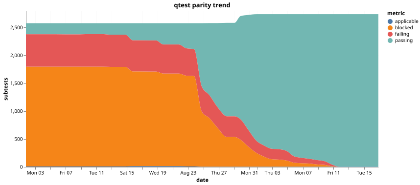
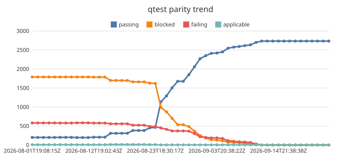

# qtest nightly metrics

Time series of the nightly qtest acceptance run, one JSON record per night in
`metrics.jsonl`. See the main branch for the harness itself.

## Trend (Vega-Lite via vl-convert)

## Trend (fulgur-chart — dogfooding)

Rendered from the same Vega-Lite spec via [fulgur-chart](https://github.com/fulgur-rs/fulgur-chart)'s
`--dsl vegalite` subset. Kept alongside the canonical chart while fulgur-chart is under active
development; discrepancies are expected and are the point.

## Parity ledger trend (Vega-Lite via vl-convert)

Ledger state counts from `parity-metrics.jsonl`. `passing` should climb while
`blocked` and `failing` drain into it. `excluded` is omitted — it is a scope
decision, not progress. The series starts 2026-07-30, when the parity manifest
was introduced; nights before that have no parity data to plot.

## Parity ledger trend (fulgur-chart — dogfooding)

Plotted as lines rather than the stacked area above: chart-cli `0.1.20`
does not implement the `area` mark yet. Same data, same series, different form.

