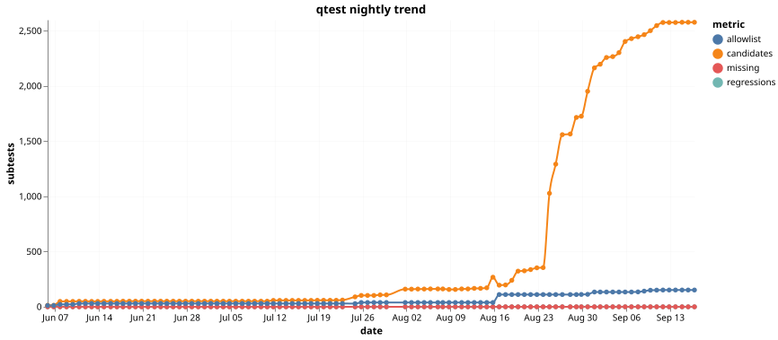
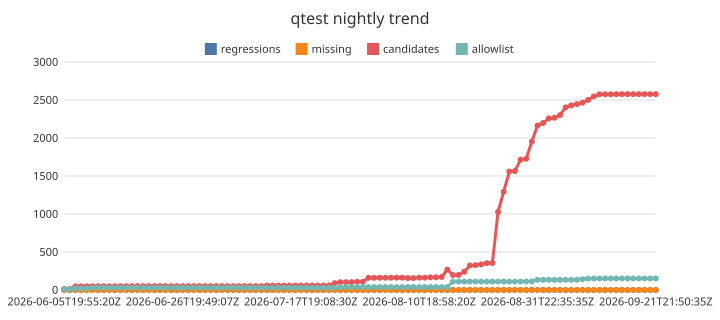

# qtest nightly metrics

Time series of the nightly qtest acceptance run, one JSON record per night in
`metrics.jsonl`. See the main branch for the harness itself.

## Trend (Vega-Lite via vl-convert)

## Trend (fulgur-chart — dogfooding)

Rendered from the same Vega-Lite spec via [fulgur-chart](https://github.com/fulgur-rs/fulgur-chart)'s
`--dsl vegalite` subset. Kept alongside the canonical chart while fulgur-chart is under active
development; discrepancies are expected and are the point.

